# Grievance Management System (GMS)

> A web-based platform that lets students and staff submit, track, and resolve grievances through a single structured channel, instead of relying on informal methods like emailing a teacher or talking to the HOD in person.

This project is being developed as part of our academic project for the **Department of Electronics and Computer Engineering, Pulchowk Campus**.

## 🌐 Live Demo

[Visit the deployed application](https://grievance-management-module.itclub.asmitphuyal.com.np)

### Demo Credentials

| Role          | Username      | Password     |
|---------------|---------------|--------------|
| HOD (Electronics & Computer)  | `computer`   | `darpangiri` |
| HOD (Electrical)              | `electrical`  | `darpangiri` |
| HOD (Mechanical)              | `mechanical`  | `darpangiri` |
| HOD (Civil)                   | `civil`       | `darpangiri` |
| HOD (Architecture)            | `architecture`| `darpangiri` |
| HOD (Applied & Chemical)      | `chemical`    | `darpangiri` |
| HOD (General)                 | `general`     | `darpangiri` |
| Campus Admin                  | `campusadmin` | `darpangiri` |
| Student                       | `080bct024`   | `darpangiri` |

---

## Table of Contents

- [Live Demo](#-live-demo)
- [Features](#features)
- [Screenshots](#screenshots)
- [System Roles](#system-roles)
- [Tech Stack](#tech-stack)
- [Getting Started](#getting-started)
- [Team](#team)

---

## Features

### Authentication & Roles
- Self-registration for Students and Staff (with department selection)
- Secure, role-based login and RBAC for **Student**, **Staff**, **HOD**, and **Campus Admin**
- Password reset and profile management

### Grievance Submission
- Grievance submission with title, detailed description, category, and file attachments
- **Fully anonymous option** — trackers get a one-time secret code to monitor progress
- **Sensitive grievance flag** — department staff/HOD/Admin must confirm before viewing sensitive content
- **AI-based spam filtering** with confidence scores so genuine issues are prioritized
- **Automatic routing** of grievances to the correct department
- Submission rate limiting to prevent spam

### Grievance Lifecycle
- Full status workflow with valid transitions between every state (see table below)
- Full **status history** with remarks and timestamps for every transition
- **Reminder comments** so submitters can nudge the HOD when a grievance gets stuck
- **Attachments** on grievances and reopen requests

#### Grievance Statuses

| Status | Description |
|--------|-------------|
| **Submitted** | Grievance filed; awaiting HOD review |
| **Under Review** | HOD is working on the grievance |
| **In Progress** | Resolution underway |
| **Reopened** | Student reopened a resolved/rejected grievance |
| **Escalated** | Automatically escalated to Campus Admin after `7 days` or left unresolved |
| **Resolved** | Grievance addressed; awaiting submitter confirmation |
| **Rejected** | Dismissed by the HOD/Admin |
| **Closed** | Finalized after resolution or submitter acknowledgement |

### Appeals, Reopens & Escalations
- **Reopen requests** and **rejection appeals** for submitters
- **Spam appeals** when the AI flags a legitimate grievance
- **Automatic escalation** to the Campus Admin if a grievance is not addressed within 7 days
- **Forwarding** of requests to the correct department by the Campus Admin

### Dashboards & Reporting
- Role-based dashboards for tracking and managing grievances
- **Charts** (department/status analytics) for HODs and the Campus Admin
- Search, filtering, and **CSV/Excel export** of grievances

### Notifications
- Email notifications for status changes, escalations, and admin decisions

---

## Screenshots

| Landing Page | After Student Login |
|:---:|:---:|
| 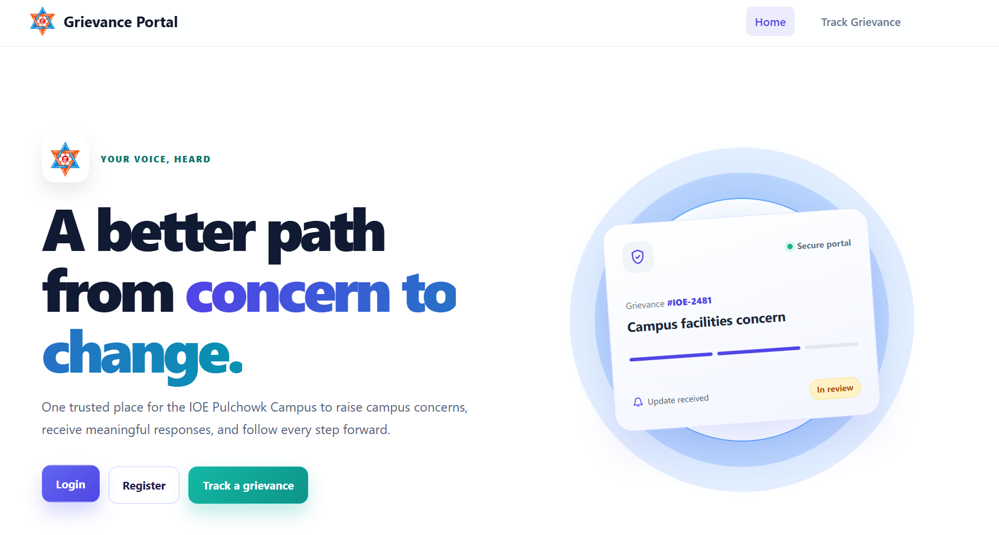 | 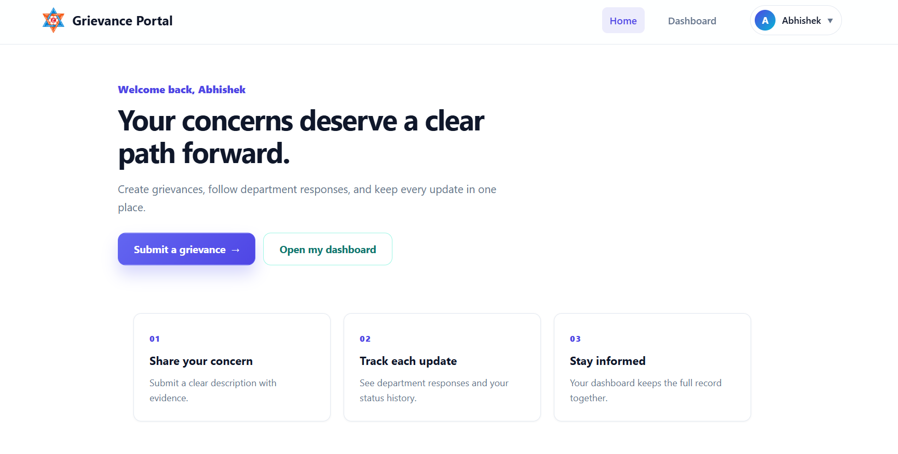 |

| Submit Grievance | Grievance Submitted |
|:---:|:---:|
| 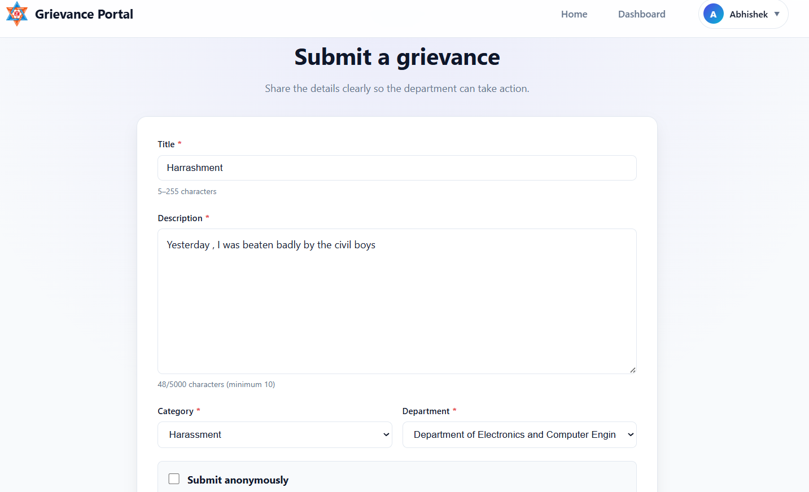 | 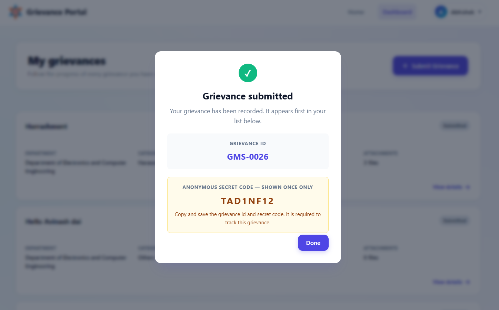 |

| Track Grievance | My Grievances (Student Dashboard) |
|:---:|:---:|
| 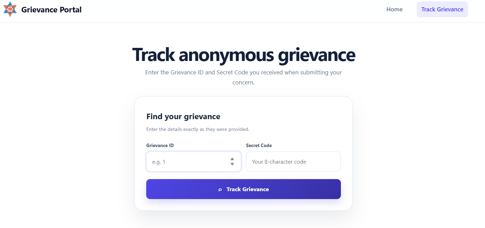 | 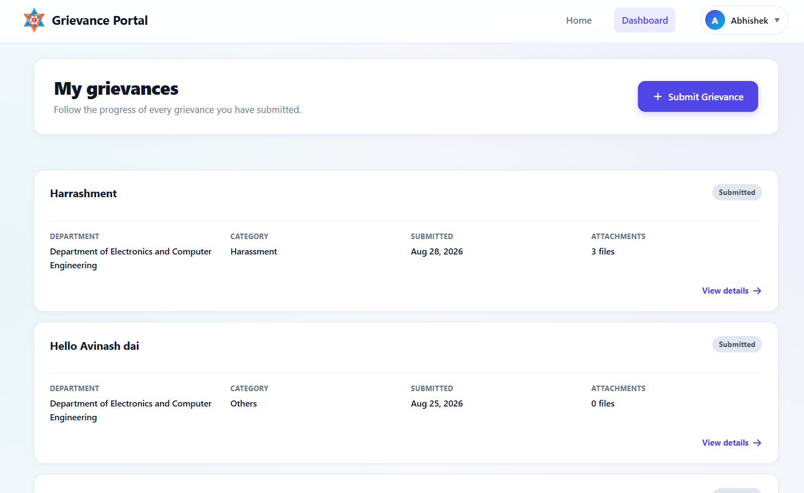 |

| Grievance Detail | HOD Dashboard |
|:---:|:---:|
| 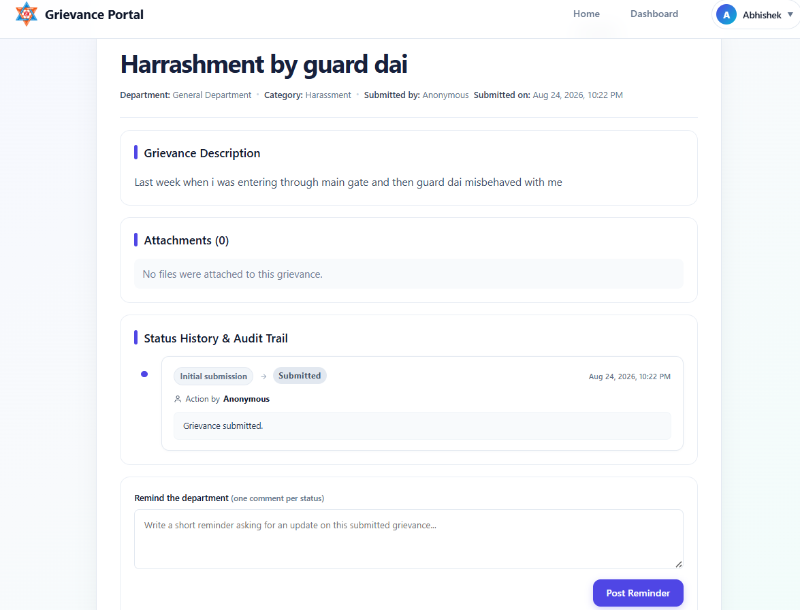 | 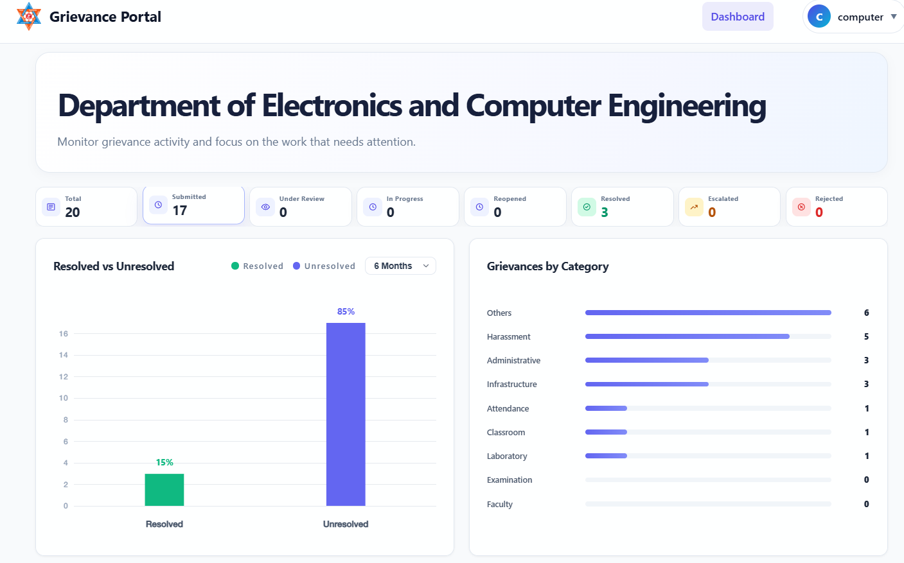 |

| HOD Response | Campus Admin Dashboard |
|:---:|:---:|
| 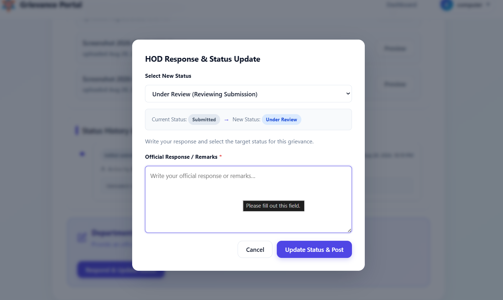 | 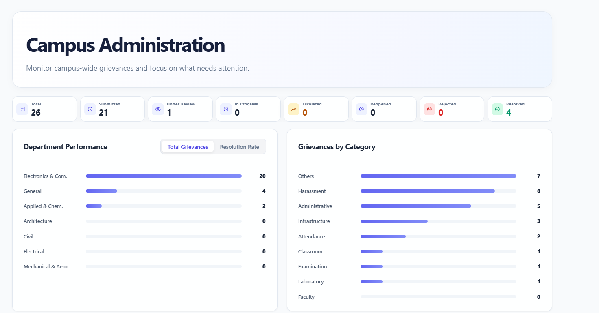 |

| Campus Grievance Trend | System Config & Policies |
|:---:|:---:|
| 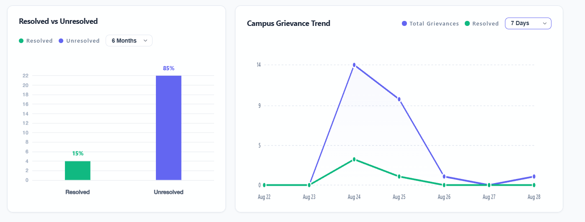 | 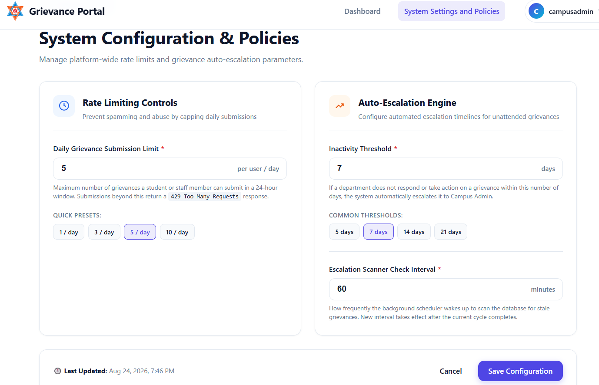 |


---

## System Roles

| Role | Can Do |
|------|--------|
| **Student / Staff** | Register, submit and track grievances (optionally anonymous/sensitive), remind the HOD, appeal rejections, request reopens |
| **Staff** | Same as Student (department staff also help manage the department queue) |
| **HOD** | Review and respond to grievances of their department, resolve/reject, handle AI spam flags |
| **Campus Admin** | System-wide oversight, escalate & forward requests, review escalations, manage analytics |

---

## Tech Stack

- **Front End:** React 19 + Vite, Axios, react-router-dom
- **Back End:** Django (Django REST Framework)
- **ML / NLP:** scikit-learn, NLTK
- **Database:** PostgreSQL

---

## Getting Started

### Prerequisites

- Node.js and npm
- Python 3 and pip
- PostgreSQL

### Backend Setup

```bash
cd backend
python -m venv venv
source venv/bin/activate
pip install -r requirements.txt
python -c "import nltk; nltk.download('punkt'); nltk.download('stopwords'); nltk.download('punkt_tab')"
python manage.py migrate
python manage.py runserver
```

### Frontend Setup

```bash
cd frontend
npm install
npm start
```

---

## Team

Group Name: **The Committers**

- [Alex Shrestha](https://github.com/shresthaAlex) (080BCT012)
- [Darpan Giri](https://github.com/darpanhh) (080BCT024)
- [Avinash Kumar Yadav](https://github.com/avinashyadav17) (080BCT018)
- [Abhishek Tharu](https://github.com/ProgAbhishek) (080BCT008)